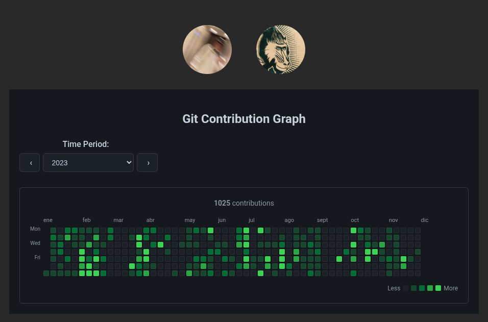
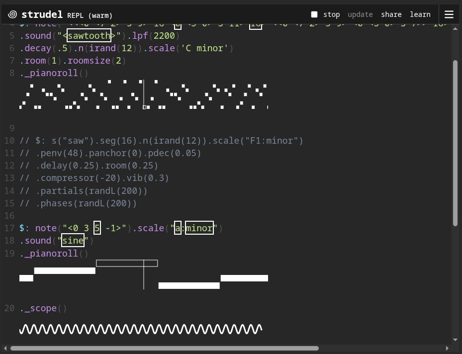

# Welcome to my Portfolio code source

For now there is only my complete contribution graph (all years) from gitlab and github (except some of my projects lost in corporate clouds).

I intend to present and publish a demo for each of my cool projects (including some of my computer science study classes).

You can run a test run of a music maker code language called Strudel.

## Run this website

To publish it, we need github pages cause they are cheap (free).

### Quick start

You need two tokens for the Contributions Graph (with their needed permission).

- GitHub: repo, user
- GitLab: read_user, read_repository

Then run `npm run dev`
